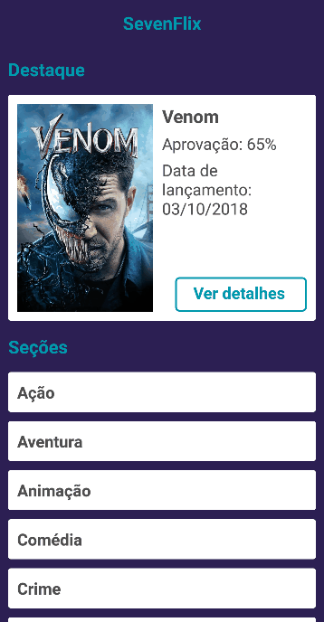

# SevenFlix

This is a challenge project proposed by [@gabrielrangel95](https://github.com/gabrielrangel95).
Basically, this app consumes the TMDB API and show details about the movies. Built in React Native.

## Result demo

## Libs Used

- Styled Components
- Reactotron
- React DevTools
- React-navigation

## Backend

I'm using [The Movie DB API](https://www.themoviedb.org/), consuming using Axios lib.
